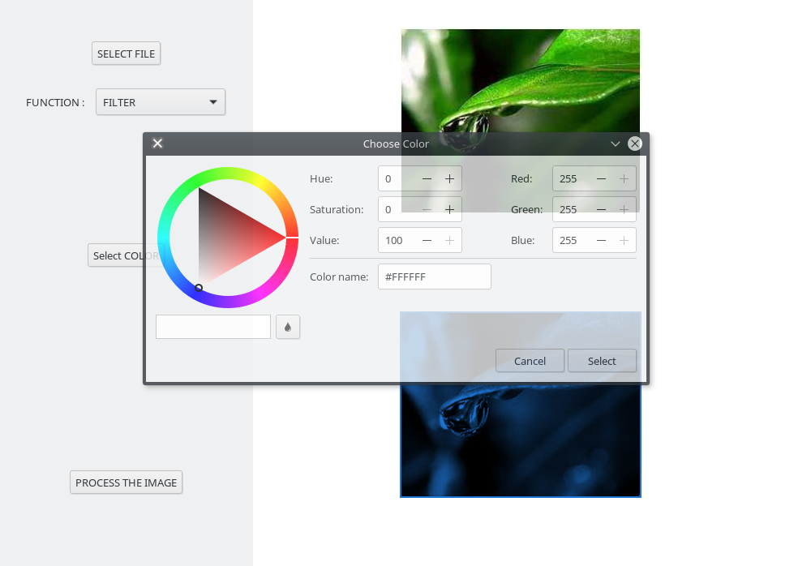
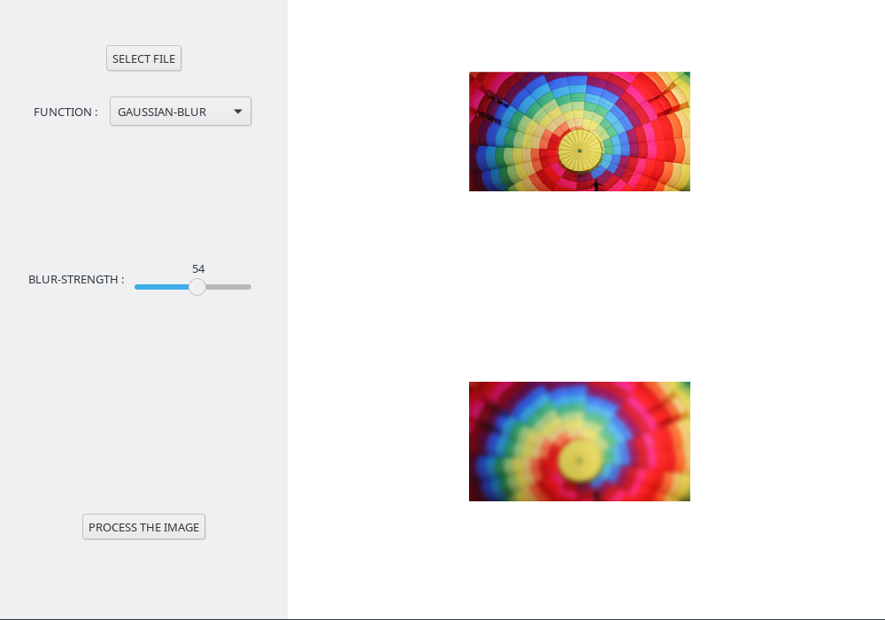

# Image Editing Tool
> This project is a simple-and-tiny image editing tool made using the Racket programming language and it's GUI.

You may want to check out the [Proposed Project](docs/proposed_project.pdf) file for more details. It was made as a final project of the CS154 (Abstractions and Paradigms in Programming - Lab) course at IIT Bombay.

## Getting Started

Follow the instructions below to get our project running on your local machine.

1. Make sure your machine has the required prequisite softwares and tools.
2. To run the game, run the `GUI.rkt` file! Yaay. Enjoy!
3. You many want to use the images in [sample_images](/src/sample_images) directory to check out the results and output.

### Prerequisites

* Racket - Install Racket from the [official website](https://racket-lang.org/).

## Screenshots

	|	
:------------------------------------------------------:|:------------------------------------------------------:
## Authors

* **Vamsi Krishna Reddy Satti** - *Initial work* - [vamsi3](https://github.com/vamsi3)
* Yaswanth Kumar Orru
* Sathvik Reddy Kollu

## License

This project is licensed under the MIT License - see the [LICENSE](LICENSE) file for details.
